# Novel Generation in Continious Cellular Automaton

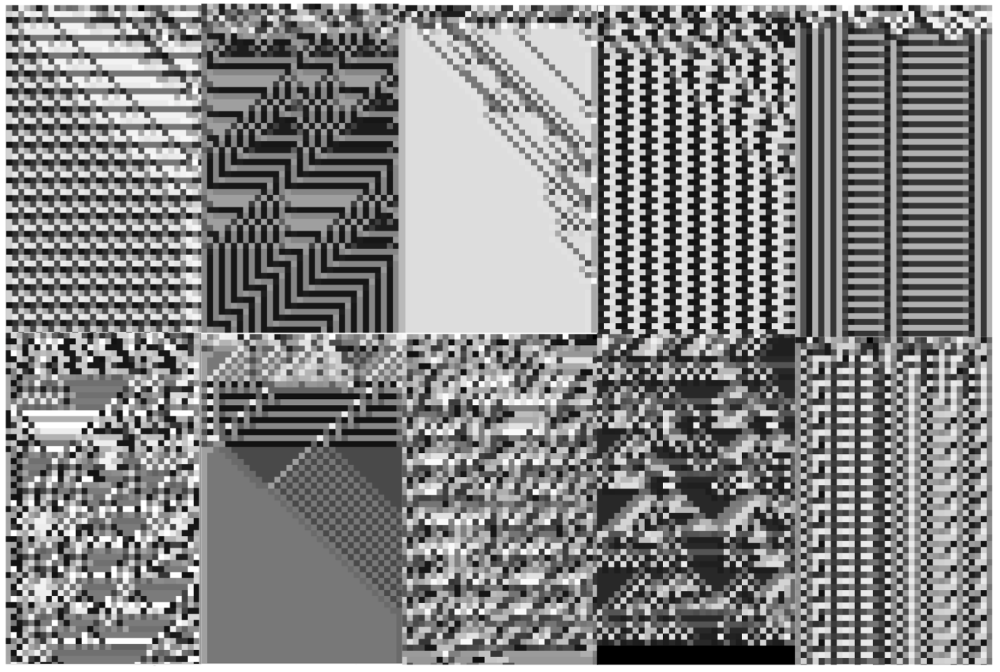

## Summary
---
The objective of this project is to explore the idea of novelty and novel generation in complex system. Specifically...
1. Finding ways to measure our intuitive sense of how new and unique the outputs of a system.
2. Using such a metric to go backwards and try to create a system which maximizes novelty.

Experiments in measuring and maximizing novelty are done in a 1D continious cellular automaton world which is described in more detail below.

## Background
---
**Open-Endedness:** Open-ended evolution (OEE) is described roughly as the unbounded growth of complexity and novelty of a system in similiar to natural evolution in contrast to existing evolutionary algorithms which converge on a solution of interest. In order to be able to build open-ended systems, a better understanding of what criteria an open ended system should meet and clear metrics for measuring a systems success in meeting such criteria is needed. There is growing consensus that an open-ended system must have certain dynamics including the continual generation of novel states as well as the potential for unbounded growth in complexity and diversity. However, if there exist other essential dynamics, how such dynamics are measured, whether satisfying the criteria by such measures would be sufficient to declare a system to be open-ended are still open questions

**Novelty:** The focus of this project is the novelty aspect of open-endedness. Specifically finding a metric for a system which captures our intuitive sense of how new and unique the outputs of a system are. Some methods of measuring novelty are described in Dolson et al. 2019. Difficulty of applicability is a common problem among the metrics described in these papers so another aim of this project is to find a novelty metric which is simple enough to flexibly apply to different types of complex systems

**Cellular Automaton:** Experiments on measuring and generating novelty are performed in a 1D continious cellular automaton (CCA) system. The CCA rule is randomly generated and the output is visualized with the horizontal being the spatial dimension and vertical being the time dimension. A simple method of generating rules used here is to generate a 3D matrix size RxRxR with random values between 0 and 1. In order to generate the next value of a cell, the current cell value and its two neighbor values can be used as coordinates and the value at those coordinates is the next state of the cell.

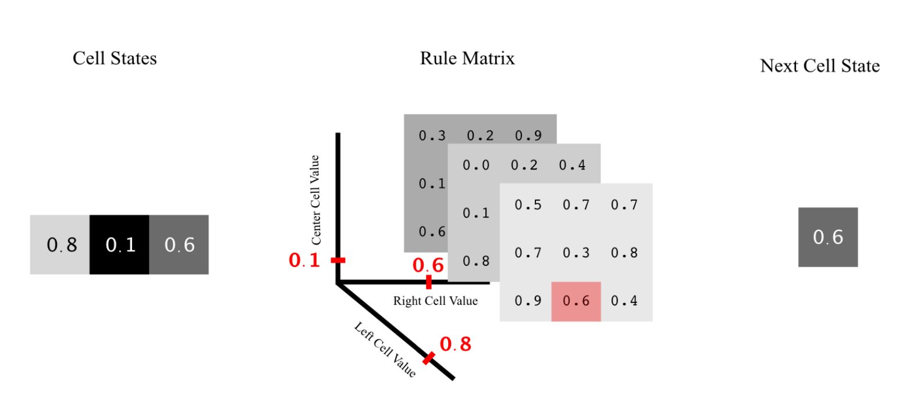

See the project report for more details.

## Measuring Novelty
---
In this project, 3 metrics are compared in NetLogo to see how they capture or intuitive sense of how novel the patterns generated in the CCA are. The 3 metrics explored are...

1. **Steps to Repeat:** The number of time steps before the CCA generates a state identical to one already generated.

2. **Sparsity:** The average distance between the current generated state and the k nearest previous states. The second equation is a continious approximation of the same measure where all distances are weighted by proximity instead of incorporated or ignored into the average entirely.

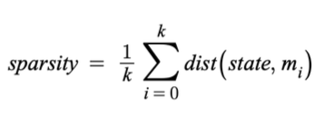

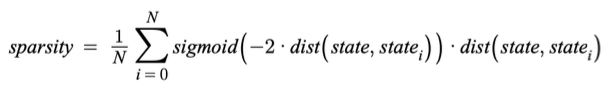

3. **Entropy Change:** The change in Shannon entropy between the last state and the current state. The second equation is a continious approximation of entropy change.

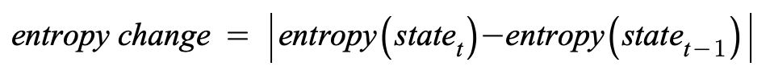

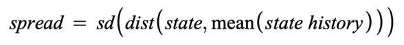

The following are example are examples of CCA outputs where the metrics yielded high and low values.

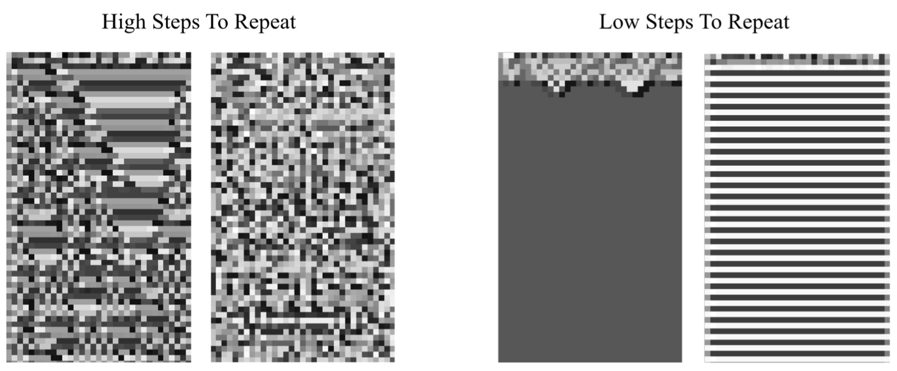
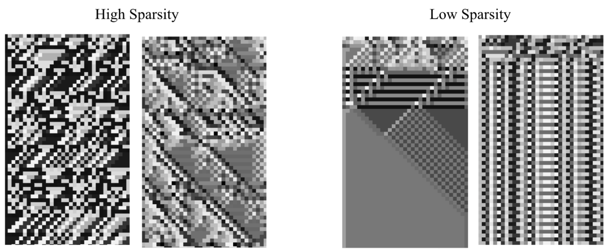
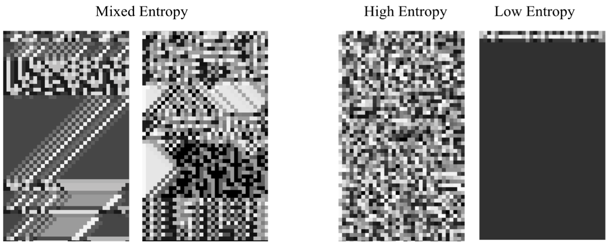

## Generating Novelty
---

Next these metrics are used as objective functions in two machine learning algorithms (neural network and genetic algorithm) to learn CCA rules which maximize for novel output.

### Neural Network: 

A 1D convolutional neural network is used to generate the next state from the previous. This is still a CCA because each agent only uses the two neighbor states to compute the next state (kernel size 3). Multiple states are generated and the loss is computed over the generated tensor as the negative of the sparsity and entropy change novelty metrics.

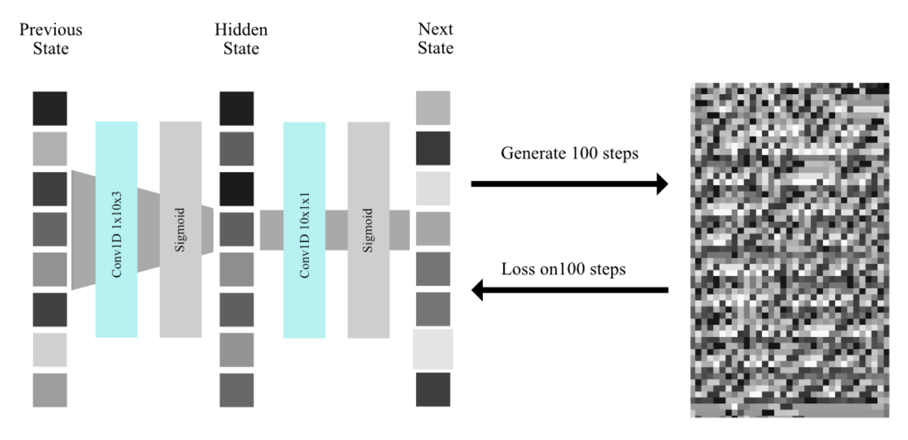

While the network was able to directly learn specific CA rules (e.g. minimize MSE between the output and Wolframs rule 30 output) when trained to do so, it had difficulty in learning to actually directly maximize for novelty. This seems likely do to the fact that the loss landscape was very rugged. Sudden drops in losses indicated tricky local minima. The generated outputs were very simple, either repeating stripes or a pattern which quickly died out.

### Genetic Algorithm:

The genetic algorithm used the rules matrix as the rule genes and used each loss measure as the fitness function and compared how well training on a particular novelty metric scores on the other novelty metrics.

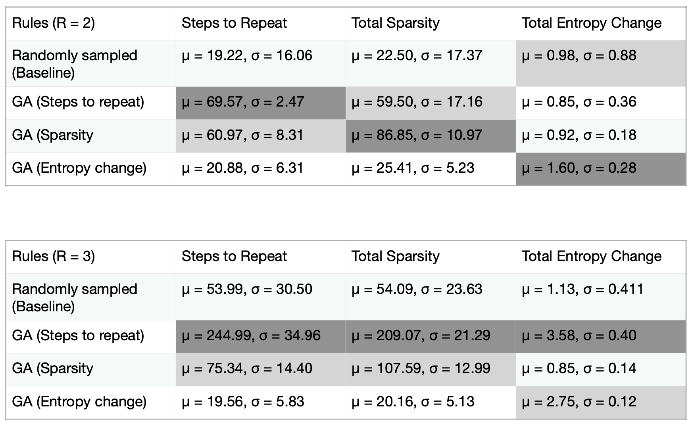

Steps to repeat mostly performed the best as it is likely the simplest metric and thus perhaps has a simpler fintness landscape. This does not necessarily need to be the case, but appeared to be here. Overall, the fitness landscape when training on the genetic algorithms appeared rugged similiar to the neural network. Additionally, the genes were very sensitive to mutations given how they were encoded and this likely significatnly hindered the genetic algorithms progess. Below are a few example outputs trained on each metric. The sensitivity of the mutation mechanism can be seen through the lack of diversity in the generated samples. That is, mutations significant enough to potentially bring new interesting patterns quickly died out.

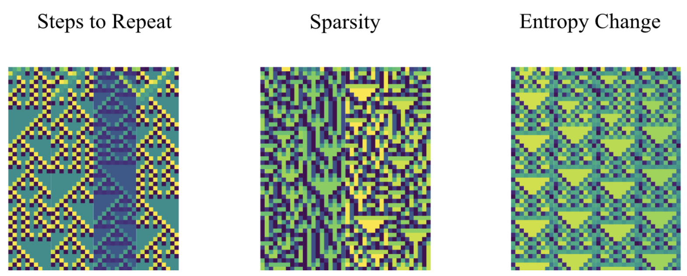

See the project report for more details.

## How to Run
To see performance of the novelty measures on randomly generated CCA rules, run the cca.nlogo file.

To run training and evaluation for the neural network, run the cca_nn.py file.

To run training and evaluation for the genetic algorithm, run the cca_ga.py file.

## References
---
1. Dolson, Emily L. et al. “The MODES Toolbox: Measurements of Open-Ended Dynamics in Evolving Systems.” Artificial Life 25 (2019): 50-73.
2. Adams, A. et al. “Formal Definitions of Unbounded Evolution and Innovation Reveal Universal Mechanisms for Open-Ended Evolution in Dynamical Systems.” Scientific Reports 7 (2017): n. pag.
3. Sughimura, Noritsugu et al. “Non-uniform Cellular Automata based on Open-ended Rule Evolution.” Artificial Life and Robotics 19 (2014): 120-126.
4. Wolfram S (2002) A new kind of science. Wolfram Media Inc, Champaign
5. András, P.. “Open-ended evolution in cellular automata worlds.” ECAL (2017).
